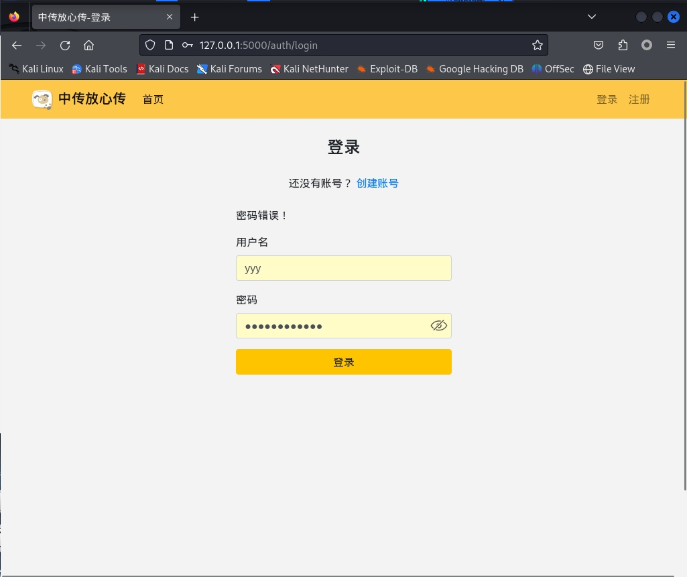
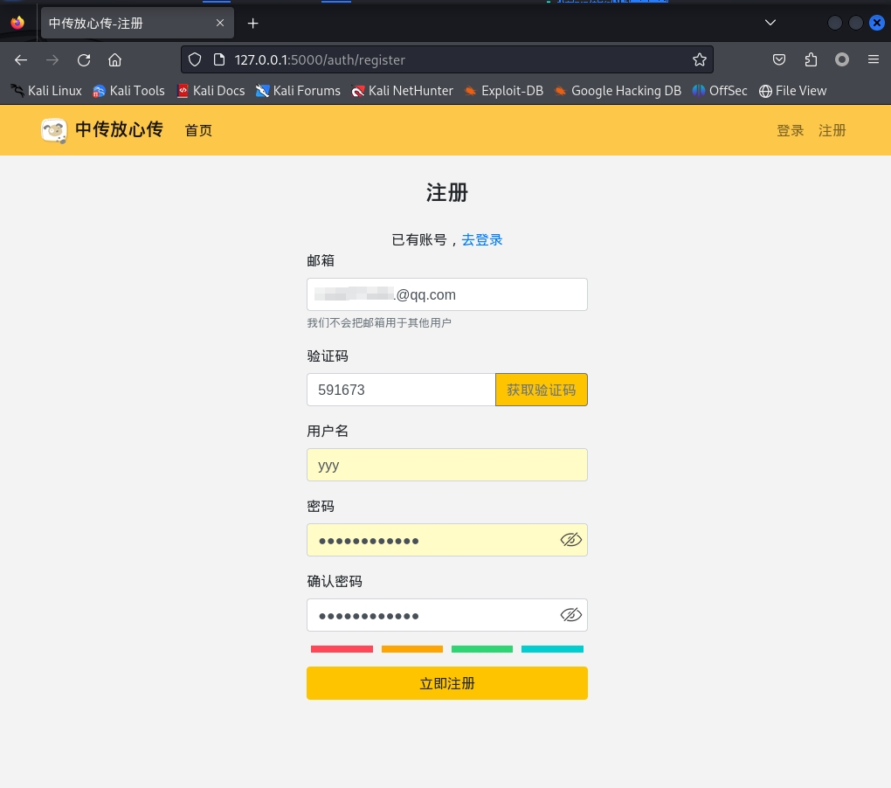
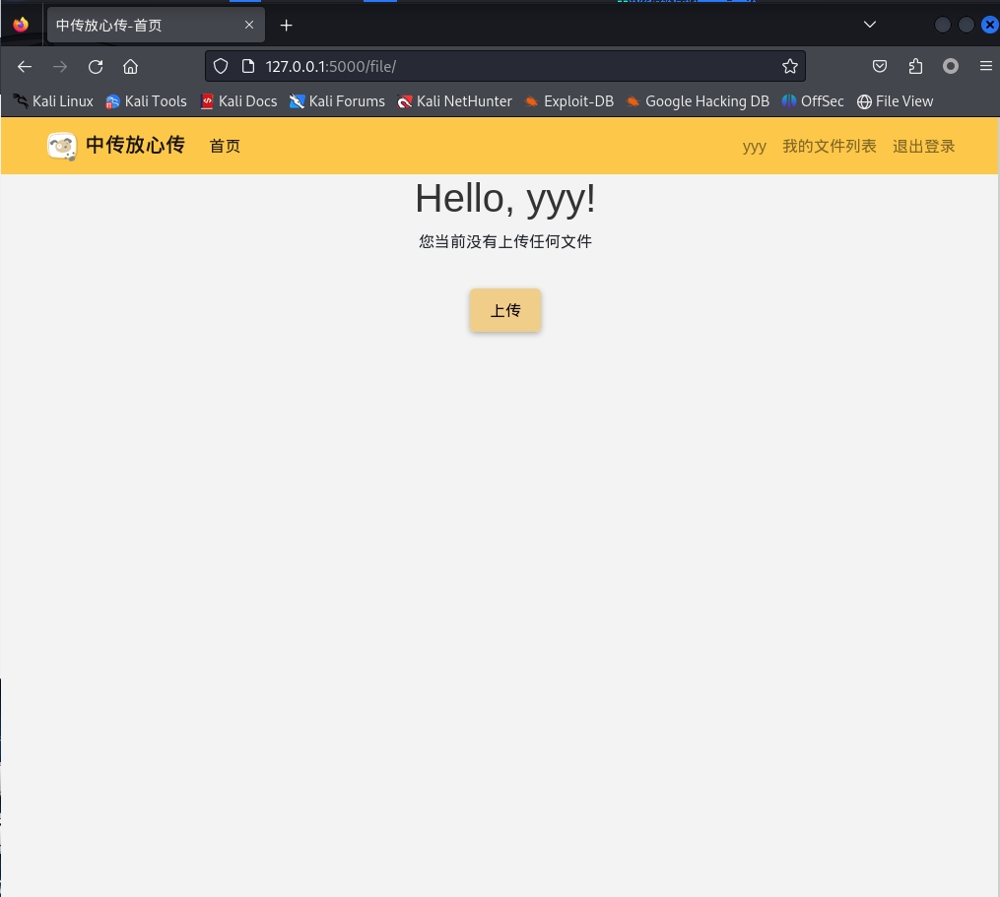
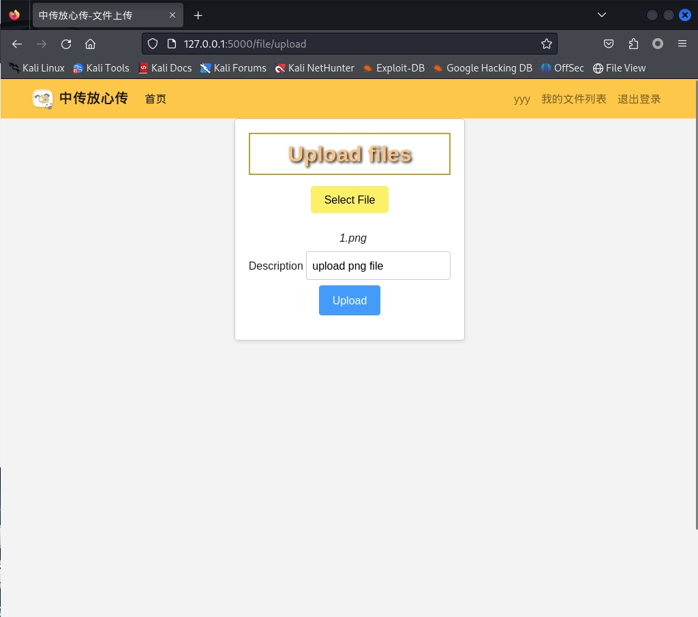
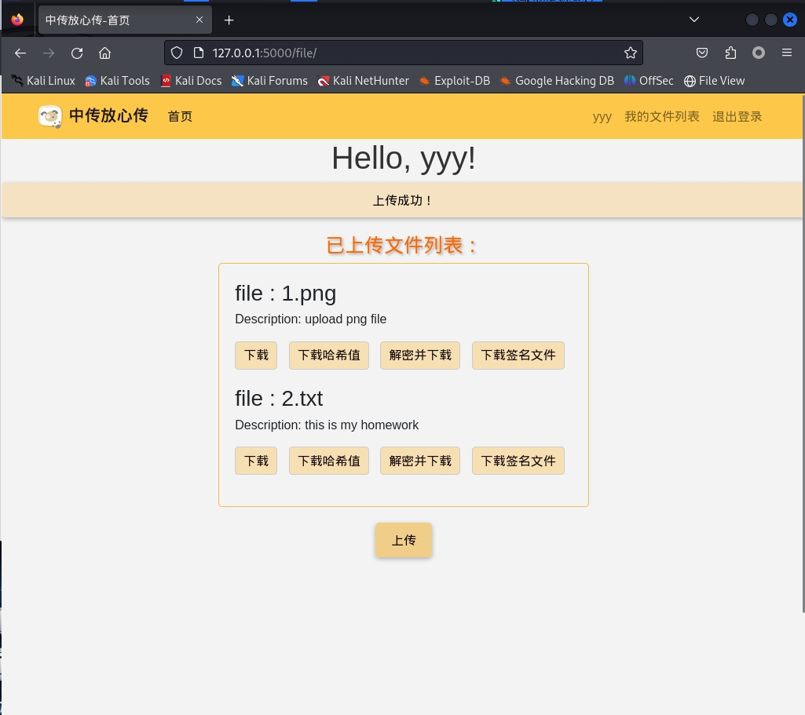
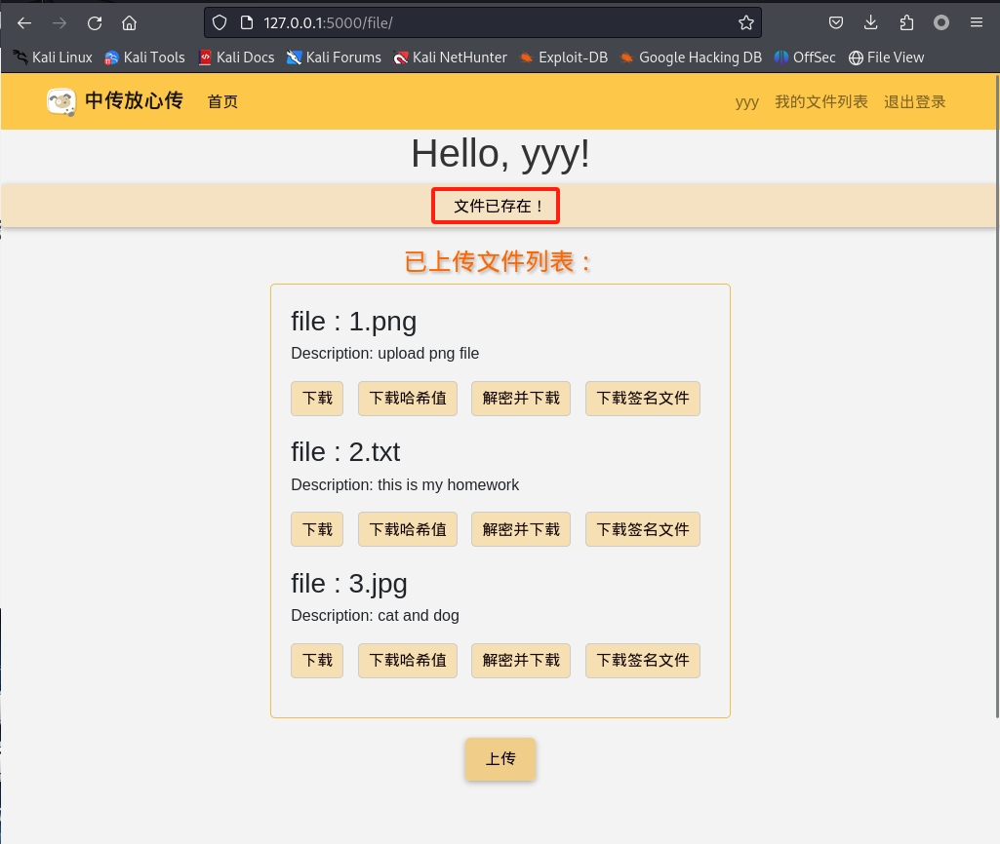
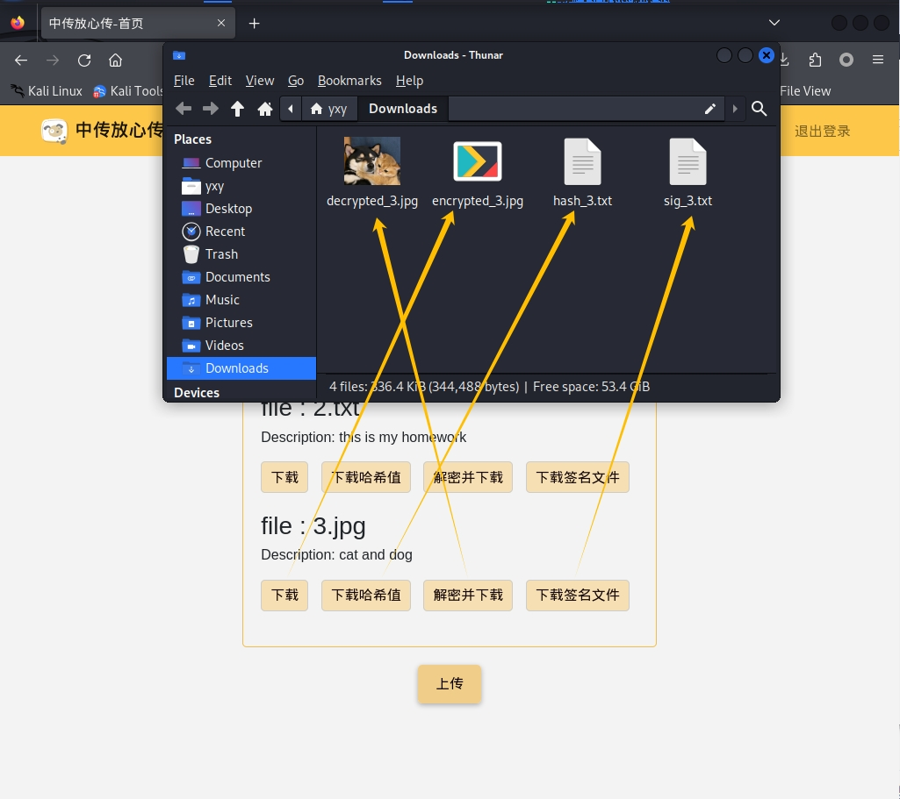
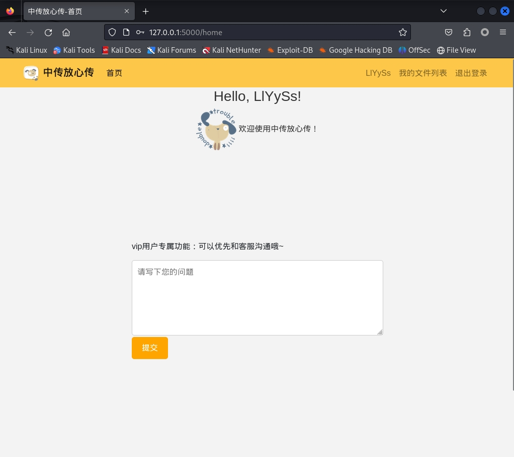

# 中传放心传 —— 软件设计文档

## 一、项目简介

“中传放心传” 是基于 Python+Flask 框架开发的一款网页云盘应用，旨在为用户提供安全可靠的文件上传备份与下载，帮助用户方便便捷地管理文件数据，记录每一份热爱！

## 二、需求分析

### 1、项目目标

- 目的：我们的目标是创建一个用户友好、安全且高效的在线存储解决方案，以满足个人和专业用户对文件存储、管理的需求

- 范围：该云盘应用是一个基于Web的平台，允许用户通过互联网访问、上传、下载和管理他们的文件

- 目标用户：
  - 个人用户：需要一个简单易用的方式来存储和备份个人文件
  - 专业用户：需要一个可靠和安全的解决方案来管理工作中的文件和协作

### 2、功能性需求

- 用户账户管理
  - 注册：用户可以创建新账户
  - 登录：用户可以使用用户名和密码登录

- 用户反馈
  - 留言板：VIP用户拥有留言板功能，可以留言与客服沟通
  - 联系我们：页面底部提供联系方式，方便用户 “联系我们”

- 文件管理
  - 文件上传：用户可以上传文件到云盘
  - 文件下载：用户可以以多种方式下载已上传的文件
  - 文件列表：展示用户上传的所有文件

- 权限与安全
  - 账户安全：实现用户密码加密存储

### 3、非功能性需求

- 可用性：用户界面直观易用

- 友好性：用户进行错误操作时，给与用户相应的提示信息

## 三、设计文档

### 1、系统架构

#### （1）目录结构介绍

这里详细介绍了该 Web应用 开发的目录结构：

```shell
source:
│  app.py # 程序的入口，包含启动服务器的代码以及相关配置
│  config.py # 应用程序的配置设置
│  database.py # 数据库的连接
│  db.py # 数据库的创建
│  Encryption_and_decryption.py  # 数据加密与解密
│  flag.txt # Flag 存放
│  forms.py # 用于创建表单
│  Pipfile # Python项目的依赖管理
│  Pipfile.lock # Python项目的依赖管理
│  README.md
│  requirements.txt # 所需的所有Python库
│
├─blueprints # Flask蓝图
│      auth.py # 处理认证（登录、注册、登出等）的逻辑
│      file.py # 处理文件上传和下载的逻辑
│      home.py # 主页的路由和视图函数
│      __init__.py 
│
├─models # 定义应用程序数据模型的Python类
│      file.py # 文件相关模型
│      user.py # 用户模型
│      __init__.py
│
├─static # 静态文件
│  ├─bootstrap
│  │      bootstrap.4.6.min.css
│  │
│  ├─css
│  │      common.css
│  │      detail.css
│  │      feedback.css
│  │      init.css
│  │
│  ├─images
│  │      6catsdogs.png
│  │      hide.png
│  │      logo.png
│  │      show.png
│  │
│  ├─jquery
│  │      jquery.3.6.min.js
│  │
│  └─js
│          filename.js
│          pStrength.js
│          register.js
│
└─templates # HTML模板文件
        base.html # 基础模板，其他模板可以继承这个模板的布局和结构
        file_list.html # 文件列表页面
        file_upload.html # 文件上传页面
        index.html # 网站首页页面
        login.html # 用户登录页面
        register.html # 用户注册页面
```

#### （2）技术栈

- 前端：HTML, CSS, JavaScript, React.js，Bootstrap
- 后端：Python, Flask
- 数据库：SQLite
- 版本控制：Git
- 包管理：Pipenv

### 2、组件设计

#### （1）核心组件

- app.py: 应用的入口点，初始化Flask应用和配置。
- config.py: 包含应用的配置参数，如数据库连接和密钥。
- database.py: 定义与数据库交互的逻辑。
- db.py: 数据库模型的定义和会话管理。
- Encryption_and_decryption.py: 实现数据加密和解密的逻辑。

#### （2）蓝图组件

- auth.py: 处理用户认证和授权的逻辑。
- file.py: 管理文件上传、下载和列表的逻辑。
- home.py: 主页的视图和逻辑。

### 3、用户界面设计

#### （1）登录页面

登录页面需要使用**用户名 + 密码**的形式进行登录

- 用户名

  - 必填：用户名字段不能为空，为必填字段
  - 提示：若用户名未经注册，在点击登录按钮后，会在页面上提示信息“用户未注册！”
  - 用户名合法：用户名不能含有非法字符，只能包含中文、英文字符和数字，若包含非法字符，则会提示信息：“用户名不可以包含非法字符”

- 密码

  - 必填字段：密码字段不能为空，为必填字段
  - 密码长度：密码长度限制在8-36字符，若密码长度不足8字符，则会进行提示
  - “小眼睛”图标：密码框中有“小眼睛”的图标，用来隐藏/显示密码，便于用户知道自己的密码输入情况



#### （2）注册页面

注册页面的表单字段都属于**必填字段**

- 邮箱

  - 注册方式：本次实验采用邮箱进行注册的方式，会向用户的邮箱发送6位验证码
  - 邮箱格式：邮箱的格式如果不正确，则不能进行获取验证码
  - 格式错误提示：可以尝试点击下方“立即注册”按钮，会有提示框表明邮箱格式的错误之处
  - 新增功能：本次系统升级，允许一个邮箱注册多个用户

- 验证码

  - 获取验证码：输入框右方有“获取验证码”按钮，当输入的邮箱正确时，便会向该邮箱发送6位的验证码

- 用户名

  - 用户名唯一：在注册时要求用户名唯一，即同一用户名只能注册一个账号
  - 用户名合法：用户名不能含有非法字符，只能包含中文、英文字符和数字

- 密码与确认密码

  - 密码长度：长度限制在8~36位，不能少于8位，否则无法完成注册
  - 添加“小眼睛”图标：通过点击该图标可以实现密码的隐藏/显示
  - 密码强度校验：
    - 密码强度可视化：在密码框下方有强度提示条，根据用户输入的密码判断密码强度，具体划分为四级，颜色从红→橙→绿→蓝，密码强度依次递增（密码字符包括：数字、小写字母、大写字母、特殊符号，根据密码中包含字符的种类数，确定密码等级）
    - 限制注册：若密码强度低（弱口令），则无法完成注册（密码至少为8位，且至少包含两种不同字符（数字、小写字母、大写字母、其他特殊符号），会在点击“立即注册”按钮后在页面展示错误信息：“不可使用弱口令，请重新设置密码”



#### （3）文件上传

- 初次使用
  - 首页提示：当用户是初次使用时，此时云盘还没有上传文件，用户将会看到如下的界面，我们将会出现提示：“您当前没有上传任何文件”



- 文件上传
  - 上传功能：若是用户需要进行文件上传，只需要点击 “上传” 即可跳转到文件选择页面，在这个页面，用户可以选择想要上传的文件进行上传
  - 上传文件类型与大小：
    - 对于普通用户，我们支持的文件类型包括 "doc", "docx", "ppt", "pptx", "xls", "xlsx", "pdf", "png", "jpg", "jpeg", "gif", "txt"，并且文件大小限制为 10MB
    - 对于vip用户，我们支持的文件类型将会更多，包括："doc", "docx", "ppt", "pptx", "xls", "xlsx", "pdf", "png", "jpg", "jpeg", "gif", "txt", "mp4", "mp3", "avi", "mkv", "mov"，文件大小限制为 50MB
  - 文件名显示：当用户选择好需要上传的文件后，页面上会出现文件名以供用户确认，例如下面所示的 “1.png”
  - 文件描述功能：用户可以为自己上传的文件添加描述，以便用户存储与记忆



#### （4）文件列表

- 文件列表获取：当用户在“文件上传”页面上传文件后，会自动跳转到“我的文件列表”，还有一种方式，用户可以在网站的首页栏，用户名旁边的“我的文件列表”，快速定位到已上传的文件



- 文件秒传：若用户上传文件已存在，则有提示框提醒：文件已存在！



#### （5）文件下载

- 文件下载方式：这里我们将提供4种文件下载方式，“下载”、“下载哈希值”、“解密并下载”、“下载签名文件”
  - 下载：这种方式下载的文件，将是一个经过对称密钥加密过的文件
  - 下载哈希值：提供静态文件的散列值下载，供下载文件完成后本地校验文件完整性
  - 解密并下载：这种方式下载的文件，就是用户上传的原文件
  - 下载签名文件：得到的是加密后文件的数字签名文件



#### （6）联系我们

- VIP用户：对于云盘的VIP用户，我们提供留言板服务，用户有任何问题，都可以在此处留言，方便用户与我们便捷沟通



- 普通用户：若是普通用户，我们将会在页面底部提供联系方式，您可以通过此处的邮箱或者电话联系我们


### 4、数据库设计

#### （1）数据库概述

本应用使用SQLite作为数据库管理系统，因其轻量级和易于配置的特点，适合中小型应用和原型开发

#### （2）数据库表设计

- 用户表（user）：存储注册用户的详细信息

| 字段         | 字段类型    | 作用                                  |
|--------------|------------|--------------------------------------|
| user_id      | INTEGER    | 用户的唯一标识符，主键，自动递增     |
| username     | VARCHAR(128) | 用户名，不允许重复                  |
| hash_password| BLOB       | 存储用户密码的哈希值               |
| user_salt    | BLOB       | 存储用户密码的盐值，用于密码哈希     |
| email        | VARCHAR(100)| 用户的电子邮件地址                |
| join_time    | DATETIME   | 用户注册时间                       |
| is_vip       | TINYINT    | 表示用户是否为VIP用户               |

- 邮箱验证码表（email_captcha）：用于存储用户注册时的验证码

| 字段          | 字段类型    | 作用                   |
|---------------|------------|------------------------|
| id            | INTEGER    | 验证码记录的唯一标识符，主键，自动递增 |
| email         | VARCHAR(100)| 关联的用户电子邮件地址   |
| captcha       | VARCHAR(10)| 生成的验证码         |

- 文件表（file）：存储用户上传的文件信息

| 字段          | 字段类型     | 作用                          |
|---------------|-------------|--------------------------------|
| file_id       | INTEGER     | 文件记录的唯一标识符，主键，自动递增   |
| user_id       | INTEGER     | 上传文件的用户ID，外键，引用用户表的user_id   |
| file_name     | VARCHAR(256)| 文件名称                      |
| description   | VARCHAR(255)| 文件描述                         |
| file_signature| BLOB        | 文件签名，用于文件唯一性验证     |
| static_hash   | BLOB        | 静态哈希值，用于文件的加密或安全特性 |
| public_key    | BLOB        | 公钥，用于文件的加密         |

### 5、安全性设计

#### （1）密码学理论

- 基于网页的用户注册与登录系统
  - 使用慢速哈希算法对用户密码生成哈希值进行保存，防止由于服务器数据库泄露威胁用户账户安全

- 基于网页的文件上传加密与数字签名系统
  - 上传加密使用对称加密，每次文件的加密密钥通过，长度固定的随机值以及用户保存的密钥单独生成，防止由于单个加密密钥泄露威胁所有文件安全
  - 对加密文件的哈希值进行数字签名，既可以验证身份，也可以用于验证文件完整性
  - 基于网页的加密文件下载与解密文件下载时在头部添加加密时的随机值，用户通过保存的密钥和随机值还原加密密钥，对文件进行解密，由于加密密钥不进行发送，由用户自己还原，保证了文件下载的安全

### （2）主要算法介绍

- 对称加密算法：AES算法
  - 主要用于用户文件的上传，下载

- 非对称加密算法：Curve25519椭圆曲线算法
  - 主要用于对称密钥种子的安全传输

- 数字签名算法：Ed25519数字签名算法
  - 主要用于用户对分享文件进行签名

- 哈希算法：sha256，bcrypt密码哈希函数
  - sha256主要用于密钥派生，与文件完整性验证
  - bcrypt密码哈希函数主要用于登录验证
