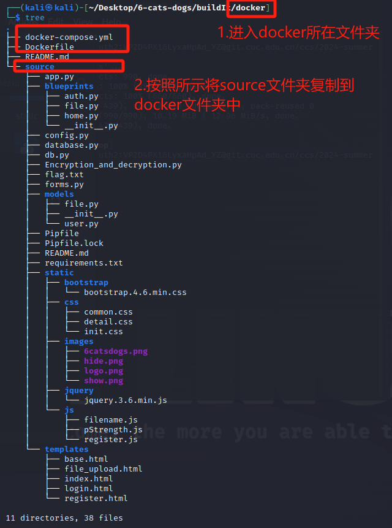

#  Docker部署：

---
## 1.创建Dockerfile和docker-compose.yml文件：

**Dockerfile:**

```shell
FROM python:3.11

WORKDIR /app

COPY ./source/cainiao /app
COPY ./source/cainiao/requirements.txt .

RUN pip install --no-cache-dir -r requirements.txt

EXPOSE 5000

CMD ["python", "app.py"]
```

**docker-compose.yml:**

```shell
version: '3.8'
services:
  web:
    build: .
    ports:
      - "5000:5000"
```

## 2.按照如下的目录结构放置文件：



## 3.安装docker、docker-compose:

```shell
sudo apt-get update
# 安装 Docker
sudo apt-get install docker.io
# 启动 Docker
sudo systemctl start docker
# 验证安装
docker version
# docker安装:https://blog.csdn.net/m0_53157282/article/details/133042812#

sudo apt install docker-compose
# docker-compose的安装：https://blog.csdn.net/sinat_17358633/article/details/128764036
```

## 4.进入到docker目录下，执行：

```shell
# 构建镜像
sudo docker-compose build

# 启动容器
sudo docker-compose up -d 

# 查看容器
sudo docker ps
```
   
**4.访问：http://localhost:5000/ 或 http://127.0.0.1:5000/ 即可。**


### 构建镜像可能遇到build很慢的问题：

更改不同的镜像源，在/etc/docker目录下创建daemon.json文件，并写入以下内容（示例）：

```json
{                                                                                                                                                      
    "registry-mirrors": ["https://dockerhub.icu"]                                                                                                              
} 
```

更改完镜像源后重启服务，重新构建镜像即可。