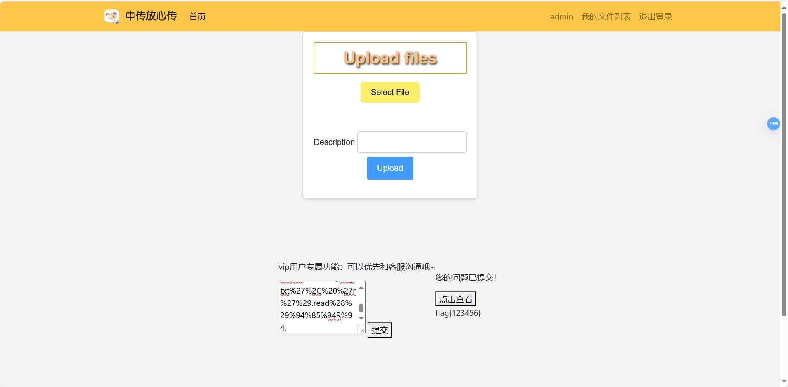
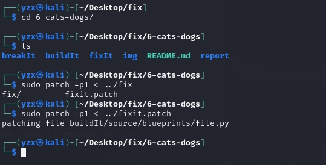

# 漏洞修复报告

## 漏洞源码修复

### SSTI 漏洞

``flask框架`` 使用 ``jinja2`` 作为其默认的模板引擎。当应用程序直接将**用户输入**的数据传递给模板引擎进行渲染，而**没有进行适当的过滤或转义时**，就可能产生SSTI漏洞。

``render_template_string()`` 函数用于渲染模板字符串。这个模板字符串包含用户输入的内容，在未经过滤和转义的情况下，导致了敏感信息的泄露。

#### 修复前

- 在 ``/source/blueprints/file.py``中：

    ```
    @file.route("/")
    def get__file():
        user = g.user
        files = File.get_by(user_id=user.user_id)
        print("============files==========")

        # 检查文件列表是否为空
        if not files:
            return render_template("index.html", username=user.username)

        print(vars(files[0]))
        intermediate_template = render_template(
            "index.html", username=user.username, files=files
        )
        return render_template_string(intermediate_template)
    ```


#### 修复后

- 修复方法：

    - 使用安全的模板渲染函数（如 render_template）
    - 输入验证和转义


    这里选择替换了更安全的渲染函数 ``render_template``。它使用的是预定义的模板文件，而不是动态生成的模板字符串，减少了用户输入直接影响模板内容的风险。

    ```
    @file.route("/")
    def get__file():
        user = g.user
        files = File.get_by(user_id=user.user_id)
        print("============files==========")

        # 检查文件列表是否为空
        if not files:
            return render_template("index.html", username=user.username)

        print(vars(files[0]))
        intermediate_template = render_template(
            "index.html", username=user.username, files=files
        )
        return intermediate_template
    ```

    

### 反序列化漏洞

``反序列化漏洞`` 是指应用程序在 **反序列化（将序列化的数据转回到其原始对象）** 过程中，由于处理不当或缺乏验证，从而导致安全风险的一类漏洞。

``pickle``可以序列化 Python 对象的**任意数据结构**，包括代码对象。``pickle.loads()`` 函数用于将序列化的字节流反序列化为原始的 Python 对象。当攻击者控制传递给 ``pickle.loads()`` 的数据，则可以通过**构造恶意负载**来执行任意代码。

#### 修复前

- 在 ``/source/blueprints/file.py`` 中：

```
file.route("/submit_feedback", methods=["POST"])
@admin_required
def submit_feedback():
    try:
        fb_path = os.path.join(fb_dir, f"feedback_{g.user.username}.pkl")

        # 获取前端输入的数据
        feedback = request.form.get("message")
        fb_path = os.path.join(fb_dir, f"feedback_{g.user.username}.pkl")

        # 获取前端输入的数据
        feedback = request.form.get("message")
        os.makedirs(os.path.dirname(fb_path), exist_ok=True)

        # 保存字节流到 .pkl 文件
        with open(fb_path, "w") as f:
            # pickle.dump(feedback, f) 且忘记了序列化
            f.write(feedback)

        print(f"Saved feedback to {fb_path}")
        session["feedback_submitted"] = True
        return render_template("index.html", form=FileForm())

    except Exception as e:
        print(f"submit Error: {e}")
        session["feedback_submitted"] = False
        return render_template("index.html", form=FileForm())

@file.route("/view_feedback", methods=["POST"])
@admin_required
def view_feedback():
    try:
        fb_path = os.path.join(fb_dir, f"feedback_{g.user.username}.pkl")
        with open(fb_path, "r") as f:
            file_content = f.read()

        print("file content:{}".format(file_content))

        file_content = urllib.parse.unquote_to_bytes(file_content)
        feedback = pickle.loads(file_content)
        form = FileForm()  # 创建一个表单对象

        return render_template("index.html", flag=feedback, form=form)


    except Exception:
        return render_template(
            "index.html",
            flag="unquote_to_bytes() or pickle.loads() error! Please input again!",
            form=FileForm()
        )
```

提交正常信息：


提交恶意负载：




#### 修复后

- **修复方法**：将不安全的 ``pickle`` 替换为 ``JSON``。

    - 修改存储反馈数据的路径和格式：从 ``.pkl`` 文件改为 ``.json`` 文件

    - 使用 ``json.dumps`` 进行序列化

    - 使用 ``json.loads`` 进行反序列化

- **修复原理**：``json`` 是一种轻量级的数据交换格式，它只能序列化**基本数据类型**（如字符串、数字、列表、字典等），不支持复杂的 Python 对象或函数调用。因此，json 序列化的数据不具备执行任意代码的能力，从而避免了因序列化数据中包含恶意代码而导致的安全问题。

```
@file.route("/submit_feedback", methods=["POST"])
@admin_required
def submit_feedback():
    try:
        fb_path = os.path.join(fb_dir, f"feedback_{g.user.username}.json")

        # 获取前端输入的数据
        feedback = request.form.get("message")
        fb_path = os.path.join(fb_dir, f"feedback_{g.user.username}.json")

        # 获取前端输入的数据
        feedback = request.form.get("message")
        os.makedirs(os.path.dirname(fb_path), exist_ok=True)

        with open(fb_path, "w") as f:
            # pickle.dump(feedback, f) 且忘记了序列化
            # f.write(feedback)
            json.dump(feedback,f)

        print(f"Saved feedback to {fb_path}")
        session["feedback_submitted"] = True
        return render_template("index.html", form=FileForm())

    except Exception as e:
        print(f"submit Error: {e}")
        session["feedback_submitted"] = False
        return render_template("index.html", form=FileForm())

@file.route("/view_feedback", methods=["POST"])
@admin_required
def view_feedback():
    try:
        fb_path = os.path.join(fb_dir, f"feedback_{g.user.username}.json")
        with open(fb_path, "r") as f:
            file_content = f.read()

        print("file content:{}".format(file_content))

        #file_content = urllib.parse.unquote_to_bytes(file_content)
        feedback = json.loads(file_content)
        form = FileForm()  # 创建一个表单对象

        return render_template("index.html", flag=feedback, form=form)


    except Exception:
        return render_template(
            "index.html",
            flag="unquote_to_bytes() or pickle.loads() error! Please input again!",
            form=FileForm()
        )
```

无论提交正常信息还是恶意负载，均回显原信息：


## 使用 diff & patch 实现漏洞修复

- ``diff`` 命令用于比较两个文件的差异并生成补丁文件。

    使用 ``diff``命令生成 ``patch补丁文件``，其中 ``<dir1>`` 目录是存在漏洞的网站源代码，``<dir2>`` 目录是修复漏洞后的网站源代码。

    ```
    diff -ru <dir1> <dir2> > fixit.patch 
    ```

    其中 ``-r`` 用于比较目录时递归比较所有找到的子目录，``-u`` 以合并的方式来显示文件内容的不同。

    

    补丁文件：[fixit.patch](./fixit.patch)

- 进入存在漏洞的文件目录，使用 ``patch``命令进行``源码级别``的修复：

    ```
    patch -p1 <dir1> < ../fixit.patch 
    ```

    


## 参考文档

[Linux使用diff对比文件差异，生成补丁，patch打补丁](https://blog.csdn.net/ck784101777/article/details/104166910)